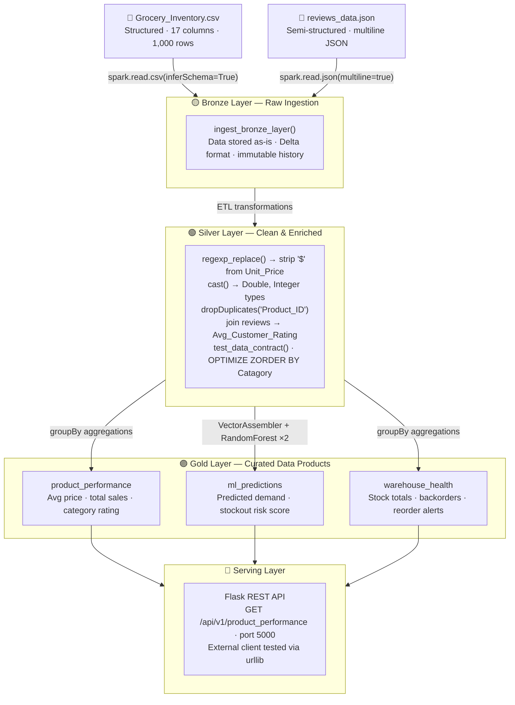

# Data-Driven Project Report: Grocery Inventory Data Pipeline

**Course:** Data Driven Computing Architectures
**Group Name:** Online10

### Team Members & Contributions
**Group Member 01: Md Belayet Hossain**

**Role:** Data Engineer (Infrastructure & ETL)

  **Contributions:** Set up the repository structure, implemented the Bronze and Silver layer ingestion pipelines (handling both CSV and JSON data), developed the ETL transformations (regex cleaning, schema evolution), and wrote the automated Data Contract testing scripts.

**Group Member 02: Nurul Amin**

  **Role:** Data Scientist / Analyst (ML, Serving & Visualization)

  **Contributions:** Developed the Gold layer business aggregations, implemented the dual PySpark MLlib models (Demand Regressor and Stockout Classifier), built the Flask REST API for data sharing, and created the pipeline telemetry logging and dashboard visualizations.

## Table of Contents
1. [Project Overview](#1-project-overview)
2. [Implemented Tasks & Rubric Fulfillment](#2-implemented-tasks--rubric-fulfillment)
3. [Pipeline Architecture Flow](#3-pipeline-architecture-flow)
4. [Data Schemas](#4-data-schemas)
5. [Illustrative Examples & Proof of Work](#5-illustrative-examples--proof-of-work)
6. [Repository Structure & Navigation](#6-repository-structure--navigation)

## 1. Project Overview

This project implements an end-to-end, production-grade data pipeline to manage, analyze, and serve grocery inventory data. The solution is built upon the **Medallion Architecture** (Bronze, Silver, Gold layers) utilizing **Apache Spark (PySpark)** and **Delta Lake** for robust, ACID-compliant data management.

Our primary objective is to ingest raw inventory and review data, clean and enrich it through an automated ETL process, generate forward-looking intelligence using Machine Learning, and serve the final data products to external clients via a RESTful API.

🔗 **[View Main Pipeline Code Here](code/Final_Project.ipynb)**

## 2. Implemented Tasks & Rubric Fulfillment

We have successfully fulfilled all the requirements outlined in the evaluation rubric. Below is the explicit breakdown of how each task was solved:

### Data Ingestion (30)
**Structured Data:** Batch ingestion of `Grocery_Inventory_new_v1.csv` using `spark.read.csv()`.

**Unstructured Data:** Batch ingestion of semi-structured customer reviews (`reviews_data.json`) utilizing Spark's `multiline=true` JSON processing.

**Real-time / Automated Batch:** Automated the ingestion process by wrapping logic into modular execution functions (`ingest_bronze_layer`) and utilized structured continuous reading workflows (`spark.readStream`) with checkpointing.

### Data Processing & Cleaning (15)
**ETL Implementation:** Cleaned the `Unit_Price` column by dynamically stripping currency symbols (`$`) and commas using `regexp_replace`, followed by casting to numeric types.

**Deduplication & Type Validation:** Enforced data integrity by aggressively dropping duplicate records via `.dropDuplicates(["Product_ID"])`.

**Advanced Metadata (Schema Evolution):** Configured Delta Lake's `.option("mergeSchema", "true")` during the Silver layer write process to handle schema drifts.

### Architecture & Advanced Features (25)
**Medallion Architecture:** Strictly partitioned the pipeline into `/bronze_layer`, `/silver_layer`, and `/gold_layer` Delta tables.

**Data Lineage:** Tagged Silver tables with advanced metadata using `ALTER TABLE ... SET TBLPROPERTIES`.

**Performance Tuning:** Optimized querying speed on the Silver layer by applying `OPTIMIZE ... ZORDER BY (Catagory)`.

**AI/ML Integration:** Implemented an automated Spark MLlib pipeline featuring a `RandomForestRegressor` (Demand Forecasting) and a `RandomForestClassifier` (Stockout Risk).

### Visualization & Dashboard (10)
**Basic Visualization:** Developed rich Seaborn/Matplotlib dashboards detailing Top 10 Sales, Warehouse Backorders, and AI Stockout Risks.

**Pipeline Statistics:** Implemented a custom tracking decorator that records processed row counts and execution times.

### Data Sharing & Data Product (25)
**Data Contract & Automated Testing:** Implemented strict validation via `assert` statements to ensure zero null `Product_ID`s and no negative `Unit_Price`s. 🔗 **[View Test Script](test/test_data_quality.py)**
**Data Product via API:** Deployed a background Flask server thread that serves the aggregated `product_performance` Gold table over HTTP.
**External Sharing:** Successfully tested external retrieval using a `urllib` client. 🔗 **[View API Example](example/api_client_example.py)**

### Logging (5)
**Structured Logging & Error Handling:** Utilized Python's standard `logging` module (`logging.basicConfig`), wrapping pipeline executions in robust `try...except` blocks.

## 3. Pipeline Architecture Flow

The data flows systematically through three distinct refinement layers:

1. **Bronze Layer (Raw):** Ingests raw CSV and JSON data "as-is" into Delta format to maintain an immutable history.
2. **Silver Layer (Cleaned & Enriched):** Applies ETL transformations, executes the Data Contract, and aggregates JSON reviews into the main inventory data. Saved with Z-Order optimization.
3. **Gold Layer (Business Value & ML):** Aggregates Silver data into specific business-level tables (`product_performance`, `supplier_performance`, `warehouse_health`) and appends ML predictions.

## 4. Data Schemas

**1. Bronze Layer (Raw Input Mappings)**
*Inventory Data:* `Product_ID`, `Product_Name`, `Catagory`, `Supplier_Name`, `Warehouse_Location`, `Status`, `Stock_Quantity`, `Unit_Price`, `Sales_Volume`
*Review Data:* `Customer_ID`, `Product_ID`, `Rating`, `Review_Text`

**2. Silver Layer (Cleaned & Enriched)**
Corrected types: `Unit_Price` (Double), `Stock_Quantity` (Integer)
Appended fields: `Avg_Customer_Rating` (Double)

**3. Gold Layer (Curated Data Products)**
*`product_performance`*: `Product_Name` (String), `Catagory` (String), `Avg_Price` (Double), `Total_Sales` (Integer), `Category_Rating` (Double)
*`ml_predictions`*: `Product_Name` (String), `Catagory` (String), `Predicted_Demand` (Double), `Predicted_Stockout_Risk` (Double)

## 5. Illustrative Examples & Proof of Work

To verify the pipeline execution, we have provided screenshots and examples of the final outputs in the `example/` and `docs/` folders.

**[View Pipeline Operational Statistics](docs/Pipeline_Operational_Statistics.png):** Demonstrates our custom execution time and record tracking.

**[View Executive Dashboard](docs/Grocery_Inventory_Pipeline_executive.jpg):** Visualizations built from the Gold aggregated tables.

**[View AI ML Insights](docs/AI_Insights_Demand_Stockout_Risk.jpg):** Dual Random Forest model outputs mapping Predicted Demand vs. Stockout Risk.

**[View API Output Evidence](example/Screenshot_API.png):** The successful JSON payload response captured by our external client simulator.

## 6. Repository Structure & Navigation

Please use the links below to navigate our submission:

* 📁 **[code/](code/)**: Contains the main pipeline execution scripts.
 * 📄 `Final_Project.ipynb` (Main PySpark Pipeline)
* 📁 **[data/](data/)**: Contains the sample datasets.
 * 📄 `Grocery_Inventory_new_v1.csv`
 * 📄 `reviews_data.json`
* 📁 **[docs/](docs/)**: Contains system architecture and visual outputs.
 * 🖼️ `Pipeline_Operational_Statistics.png`
 * 🖼️ `Grocery_Inventory_Pipeline_executive.jpg`
 * 🖼️ `AI_Insights_Demand_Stockout_Risk.jpg`
* 📁 **[example/](example/)**: Contains examples of the pipeline working and external connection tests.
 * 📄 `api_client_example.py`
 * 🖼️ `Screenshot_API.png`
* 📁 **[test/](test/)**: Contains data validation logic.
 * 📄 `test_data_quality.py` (Data Contract)
* 📁 **[misc/](misc/)**: Contains project notes and raw assignment criteria.

